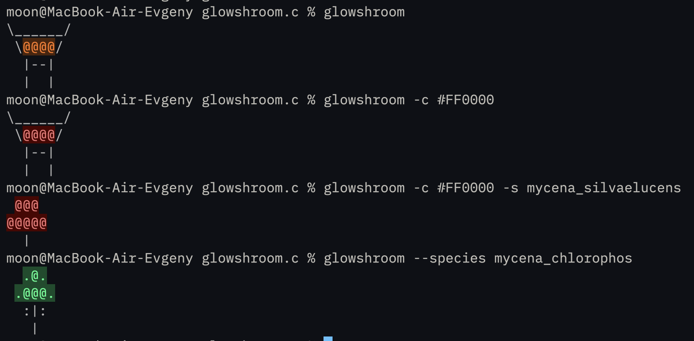

# glowshroom

A CLI tool that renders bioluminescent ASCII mushrooms to the terminal.



## Requirements

- GCC or Clang
- POSIX-compatible system
- True Color terminal support

## Build

```bash
make
```

## Install / Uninstall

```bash
sudo make install
sudo make uninstall
```

## Usage

```bash
glowshroom [options]
```

Options:
- `-h, --help` - Show help
- `-c, --color <hex>` - Glow color in hex format (e.g., `00ff88`)
- `-s, --species <name>` - Mushroom species to render

> **Note:** `#` is optional. Using it in shell requires quoting (`'#00ff88'`) or escaping (`\#00ff88`).

Species:
`mycena_chlorophos`, `panellus`, `omphalotus_olearius`, `mycena_luxaeterna`, `armillaria_mellea`, `mycena_silvaelucens`

## Motivation

A small project combining terminal art with C practice. ASCII aesthetics have a certain charm, and bioluminescent fungi are interesting subjects. Nothing more, nothing less.

## Contributors

ASCII artists are welcome to contribute new mushroom templates. See `src/template.c` for the format.

## License

MIT
